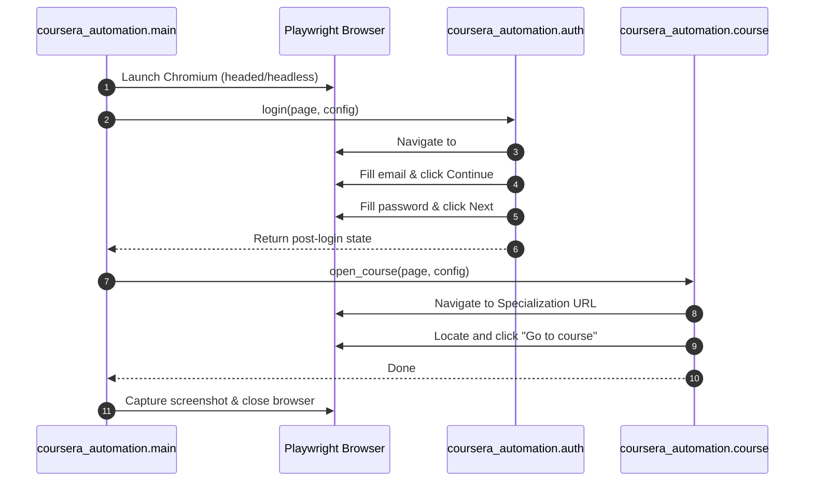

# Architecture & Design

This project automates Coursera workflows using Playwright in Python, strictly adhering to NASA JPL Rule 4 and the 3-step verification loop.

## Design Principles

1. **NASA JPL Rule 4 (Single Sheet of Paper)**:
   Every module and function is compact (≤ 60 lines of code) with a single, clear responsibility.
2. **Deterministic Selectors**:
   Interactions utilize Playwright role-based and accessible locators (`get_by_role`, `get_by_label`, `get_by_placeholder`) with resilient fallbacks.
3. **Clean Configuration**:
   All operational parameters and credentials are encapsulated in an immutable dataclass (`Settings`) with environment variable overrides.

## Workflow Sequence

## Module Breakdown

- `coursera_automation/config.py`: Environment configuration and typed dataclass.
- `coursera_automation/auth.py`: Authentication interactions and modal orchestration.
- `coursera_automation/course.py`: Specialization navigation and CTA interaction.
- `coursera_automation/main.py`: Browser lifecycle management and execution runner.
- `tests/test_config.py`: Unit test verification.
