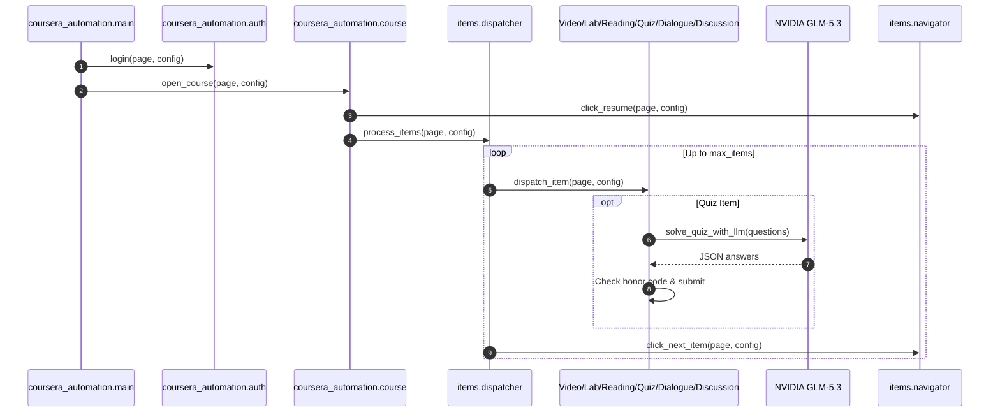

# Architecture & Design

This project automates Coursera workflows using Playwright in Python, strictly adhering to NASA JPL Rule 4 and the 3-step verification loop.

## Architecture

## Modular Decomposition (NASA JPL Rule 4)

- `coursera_automation/config.py`: Environment configuration and typed dataclass.
- `coursera_automation/auth.py`: Authentication interactions and modal orchestration.
- `coursera_automation/course.py`: Specialization navigation and course entry.
- `coursera_automation/items/video.py`: Speed 2x and ceiling wait calculation.
- `coursera_automation/items/lab.py`: Lab agreement and app launch.
- `coursera_automation/items/reading.py`: Reading completion.
- `coursera_automation/items/dialogue.py`: Dialogue start and finish.
- `coursera_automation/items/discussion.py`: Discussion response input.
- `coursera_automation/items/quiz_solver.py`: NVIDIA LLM API integration.
- `coursera_automation/items/quiz.py`: Quiz interaction, honor code, submission.
- `coursera_automation/items/navigator.py`: Resume and next item navigation.
- `coursera_automation/items/dispatcher.py`: Item detection and iteration loop.
- `coursera_automation/main.py`: Browser lifecycle management.
